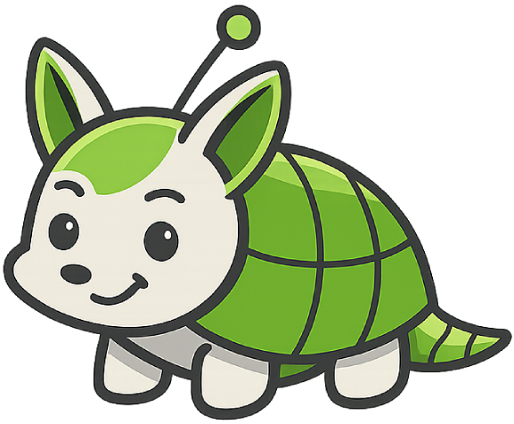

<p align="center">
  
</p>

# stewie

Governance-first orchestration system for AI-driven multi-agent software development.

Stewie coordinates multiple AI agents to build software in parallel — creating isolated workspaces, launching worker containers, managing git branches, pushing code, and opening pull requests — all under strict governance. It does not write code itself; it orchestrates agents that do.

## Architecture

```
┌─────────────────────────────────────────────────────┐
│  React Dashboard (Vite)           :5173             │
│  Projects · Jobs · Governance · Settings             │
└────────────────────┬────────────────────────────────┘
                     │ HTTP/JSON
┌────────────────────▼────────────────────────────────┐
│  .NET 10 API                      :5275             │
│  JWT Auth · Project CRUD · Job Orchestration        │
├─────────────────────────────────────────────────────┤
│  JobOrchestrationService                             │
│  Clone → Branch → Launch Container → Diff →          │
│  Commit → Push → Create PR → Governance Check        │
├─────────────────────────────────────────────────────┤
│  SQL Server 2022     NHibernate     FluentMigrator  │
└─────────────────────────────────────────────────────┘
         │                              │
    ┌────▼────┐                   ┌─────▼──────┐
    │ Docker  │                   │ GitHub API │
    │ Workers │                   │ (Octokit)  │
    └─────────┘                   └────────────┘
```

### Three-Tier Agent Hierarchy

| Role | Description |
|:-----|:------------|
| **Human** | Final authority. Sets vision, approves plans. |
| **Architect Agent** | AI project manager. Plans sprints, audits output, enforces governance. Does not write code. |
| **Developer/Tester Agents** | Execute tasks in isolated containers. Write code, run tests, produce results. |

## Prerequisites

- [.NET 10 SDK](https://dotnet.microsoft.com/download)
- [Docker Desktop](https://www.docker.com/products/docker-desktop/)
- [Node.js 20+](https://nodejs.org/) (for the React dashboard)

## Quick Start

### 1. Start SQL Server

```bash
docker-compose up -d
```

### 2. Build Worker Images

```bash
# Test worker (proves container contract)
docker build -t stewie-dummy-worker workers/dummy-worker/

# Script worker (real execution — Alpine + bash + git)
docker build -t stewie-script-worker workers/script-worker/

# Governance worker (automated GOV compliance checks)
docker build -t stewie-governance-worker workers/governance-worker/
```

### 3. Set Required Environment Variables

```bash
export STEWIE_JWT_SECRET="your-32-char-minimum-secret-key-here"
export STEWIE_ENCRYPTION_KEY="your-32-char-aes-encryption-key-here"
export STEWIE_ADMIN_PASSWORD="YourAdminPassword123!"
export STEWIE_ADMIN_USERNAME="admin"  # optional, defaults to "admin"
```

### 4. Run the API

```bash
dotnet run --project src/Stewie.Api
```

On first start:
- FluentMigrator creates the database and runs all migrations
- An admin user is seeded with the credentials from `STEWIE_ADMIN_USERNAME` / `STEWIE_ADMIN_PASSWORD`

### 5. Run the Dashboard

```bash
cd src/Stewie.Web/ClientApp
npm install
npm run dev
```

Dashboard available at `http://localhost:5173`. API at `http://localhost:5275`.

### 6. Login and Configure

1. Open `http://localhost:5173` → Login with your admin credentials
2. Navigate to **Settings** → Add your GitHub PAT (stored AES-256-CBC encrypted)
3. Create a **Project** — link an existing repo or create a new one on GitHub
4. Create a **Job** — define an objective, scope, and optional script commands
5. Stewie clones the repo, creates a branch, executes the worker, captures diffs, commits, pushes, and opens a PR

## How It Works

### Job Execution Flow

1. User creates a **Job** against a **Project** (with objective and optional script)
2. Stewie creates a **Task** and prepares an isolated workspace:
   - `workspaces/{taskId}/input/` — `task.json` with instructions
   - `workspaces/{taskId}/output/` — worker writes `result.json` here
   - `workspaces/{taskId}/repo/` — cloned repository
3. Repository is cloned, a feature branch is created (`stewie/{jobId}`)
4. A Docker container is launched with the workspace mounted (300s timeout enforced)
5. Worker reads `task.json`, executes, writes `result.json`
6. Stewie ingests the result, captures `git diff`, commits changes
7. **Governance check**: a tester task runs 15 automated checks (build, tests, coding standards, secret scanning)
8. If governance passes → branch is pushed, PR is created automatically
9. If governance fails → worker retries with violation feedback (up to 2 attempts)
10. Job/Task statuses updated, events logged for audit trail

### Governance Engine

Every worker's output is automatically validated against all 8 governance documents:

| Category | Checks |
|:---------|:-------|
| GOV-001 Documentation | README exists, XML doc comments on public members |
| GOV-002 Testing | Build succeeds, tests pass, test count > 0 |
| GOV-003 Coding Standard | No `any` types, no `console.log`, no `Console.WriteLine` |
| GOV-004 Error Handling | Error middleware present |
| GOV-005 Dev Lifecycle | Branch naming, commit message format |
| GOV-006 Logging | ILogger usage, no bare Console.Write |
| GOV-008 Infrastructure | Dockerfile present |
| SEC-001 Security | No secrets in git diff |

### Retry Logic

- **Transient failures** (timeout, Docker errors) → automatic 1 retry
- **Permanent failures** (worker crash, bad results) → no retry, failure reason recorded

## Project Structure

```
src/
  Stewie.Domain/           # Entities, enums, contracts (DTOs)
  Stewie.Application/      # Service interfaces, orchestration logic
  Stewie.Infrastructure/   # NHibernate, FluentMigrator, Docker, GitHub, filesystem
  Stewie.Api/              # ASP.NET Core API host + controllers
  Stewie.Web/ClientApp/    # React + Vite dashboard
  Stewie.Tests/            # xUnit integration + unit tests (76 tests)
workers/
  dummy-worker/            # Test worker (proves container contract)
  script-worker/           # Real worker (Alpine + bash + git)
  governance-worker/       # Governance checker (runs 15 GOV rules)
CODEX/                     # Project governance documentation
  00_INDEX/                # MANIFEST.yaml — document registry
  05_PROJECT/              # Sprints, backlog, roadmap
  10_GOVERNANCE/           # Standards (GOV-001 through GOV-008)
  20_BLUEPRINTS/           # Design specs, API/runtime contracts
  40_VERIFICATION/         # Audit reports
  80_AGENTS/               # Agent role definitions
```

## API Overview

All endpoints require `Authorization: Bearer {jwt}` (except `/api/auth/login`).

| Method | Endpoint | Description |
|:-------|:---------|:------------|
| `POST` | `/api/auth/login` | Authenticate, receive JWT (24hr expiry) |
| `POST` | `/api/auth/register` | Register new user (requires invite code) |
| `GET` | `/api/projects` | List all projects |
| `POST` | `/api/projects` | Create project (link existing repo or create new) |
| `GET` | `/api/jobs` | List jobs (optionally filter by `?projectId=`=`) |
| `POST` | `/api/jobs` | Create and execute a job |
| `GET` | `/api/jobs/{id}` | Get job details with nested tasks |
| `GET` | `/api/jobs/{id}/governance` | Get latest governance report for a job |
| `GET` | `/api/tasks/{id}/governance` | Get governance report for a tester task |
| `POST` | `/jobs/test` | Trigger a test job (dummy worker) |
| `POST` | `/api/users/github-token` | Store GitHub PAT (AES-256 encrypted) |
| `GET` | `/api/users/github-token/status` | Check PAT configuration status |

Full contract: `CODEX/20_BLUEPRINTS/CON-002_API_Contract.md` (v1.6.0)

## Configuration

Configuration via `src/Stewie.Api/appsettings.json` and environment variables:

| Key | Env Variable | Default | Description |
|:----|:-------------|:--------|:------------|
| `ConnectionStrings:Stewie` | — | localhost SQL Server | Database connection string |
| `Stewie:WorkspaceRoot` | — | `./workspaces` | Base directory for task workspaces |
| `Stewie:DockerImageName` | — | `stewie-dummy-worker` | Default Docker image for test runs |
| `Stewie:ScriptWorkerImage` | — | `stewie-script-worker` | Docker image for real task execution |
| `Stewie:TaskTimeoutSeconds` | — | `300` | Hard timeout for container execution (seconds) |
| `Stewie:JwtSecret` | `STEWIE_JWT_SECRET` | **required** | JWT signing key (min 32 chars) |
| `Stewie:EncryptionKey` | `STEWIE_ENCRYPTION_KEY` | **required** | AES-256 key for credential encryption |
| `Stewie:AdminPassword` | `STEWIE_ADMIN_PASSWORD` | **required** | Initial admin password (first startup only) |
| `Stewie:AdminUsername` | `STEWIE_ADMIN_USERNAME` | `admin` | Initial admin username |
| `Stewie:MaxGovernanceRetries` | — | `2` | Max governance retry attempts per job |
| `Stewie:GovernanceWorkerImage` | — | `stewie-governance-worker` | Docker image for governance checks |
| `Stewie:WarningsBlockAcceptance` | — | `false` | Whether warning-severity governance failures block acceptance |

## Runtime Contract

Workers communicate with Stewie via JSON files mounted in the container.

### task.json (input → `/workspace/input/task.json`)

```json
{
  "taskId": "guid",
  "jobId": "guid",
  "role": "developer",
  "objective": "Implement feature X",
  "scope": "src/services/",
  "repoUrl": "https://github.com/org/repo.git",
  "branch": "stewie/run-id",
  "script": ["npm install", "npm test"],
  "acceptanceCriteria": ["All tests pass", "No lint errors"]
}
```

### result.json (output → `/workspace/output/result.json`)

```json
{
  "taskId": "guid",
  "status": "success",
  "summary": "Implemented feature X with 3 new files",
  "filesChanged": ["src/services/foo.ts", "src/services/bar.ts"],
  "testsPassed": true,
  "errors": [],
  "notes": "Added unit tests for edge cases",
  "nextAction": "review"
}
```

Full contract: `CODEX/20_BLUEPRINTS/CON-001_Runtime_Contract.md` (v1.4.0)

## Testing

```bash
# Run all tests (76 passing)
dotnet test src/Stewie.Tests/Stewie.Tests.csproj

# Frontend build verification
cd src/Stewie.Web/ClientApp && npm run build
```

## Roadmap

| Phase | Name | Status |
|:------|:-----|:-------|
| 0 | Foundation | ✅ Complete |
| 1 | Core Orchestration MVP | ✅ Complete |
| 2 | Real Repo Interaction | ✅ Complete |
| 2.5 | GitHub Integration + Auth | ✅ Complete |
| 2.75 | Repository Automation + Platform Abstraction | ✅ Complete |
| 3 | Governance Engine | ✅ Complete |
| **4** | **Multi-Task Jobs** | 🔜 Next |
| 5 | Real-Time Interaction | Planned |

Full roadmap: `CODEX/05_PROJECT/PRJ-001_Roadmap.md`

## License

Private — all rights reserved.
